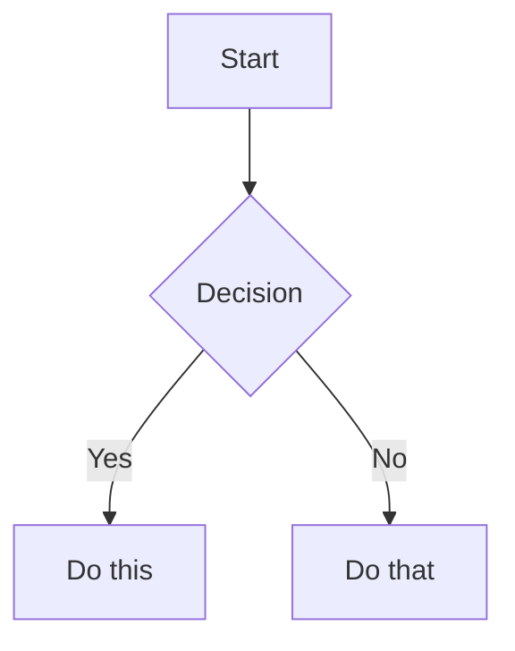

# Obsidian 完全指南

## 概述

Obsidian 是一个本地知识管理工具，本 skill 覆盖三个层面：
1. **CLI 操作** — `obsidian` 命令行工具，插件开发
2. **Markdown 语法** — Obsidian Flavored Markdown（wikilinks、callouts、properties 等）
3. **Bases 数据库** — .base 文件，表格/卡片/列表视图，公式

---

## Part 1: Obsidian CLI

### 概述
使用 `obsidian` CLI 与正在运行的 Obsidian 实例交互。需先打开 Obsidian。

运行 `obsidian help` 查看所有可用命令。完整文档：https://help.obsidian.md/cli

### 语法

**参数**用 `=` 赋值，含空格的值用引号：
```bash
obsidian create name="My Note" content="Hello world"
```

**标志**是布尔开关，无值：
```bash
obsidian create name="New Note" silent overwrite
```

多行内容用 `\\n` 表示换行，`\\t` 表示 Tab。

### 文件定位

多数命令接受 `file` 或 `path` 来指定文件目标：
- `file=<name>` — 像 wikilink 一样解析（只填名称，不需要路径或扩展名）
- `path=<path>` — 从 vault 根目录开始的完整路径

### Vault 定位

默认目标是最近一次聚焦的 vault。用 `vault=<name>` 指定特定 vault：
```bash
obsidian vault="My Vault" search query="test"
```

### 常用命令

```bash
obsidian read file="My Note"
obsidian create name="New Note" content="# Hello" template="Template" silent
obsidian append file="My Note" content="New line"
obsidian search query="search term" limit=10
obsidian daily:read
obsidian daily:append content="- [ ] New task"
obsidian property:set name="status" value="done" file="My Note"
obsidian tasks daily todo
obsidian tags sort=count counts
obsidian backlinks file="My Note"
```

使用 `--copy` 复制输出到剪贴板。使用 `silent` 防止文件自动打开。在列表命令上使用 `total` 获取计数。

### 插件开发

#### 开发/测试循环

1. **重载插件**以应用更改：
   ```bash
   obsidian plugin:reload id=my-plugin
   ```
2. **检查错误** — 有错误则修复后重复步骤 1：
   ```bash
   obsidian dev:errors
   ```
3. **视觉验证**（截图或 DOM 检查）：
   ```bash
   obsidian dev:screenshot path=screenshot.png
   obsidian dev:dom selector=".workspace-leaf" text
   ```
4. **检查控制台**输出：
   ```bash
   obsidian dev:console level=error
   ```

#### 附加开发命令

在应用上下文运行 JavaScript：
```bash
obsidian eval code="app.vault.getFiles().length"
```

检查 CSS 值：
```bash
obsidian dev:css selector=".workspace-leaf" prop=background-color
```

开启移动端模拟：
```bash
obsidian dev:mobile on
```

运行 `obsidian help` 查看更多开发命令（CDP、调试器控制等）。

---

## Part 2: Obsidian Flavored Markdown

### 概述

Obsidian 扩展了 CommonMark 和 GFM，增加了 wikilinks、embeds、callouts、properties 等语法。本节覆盖 Obsidian 特有扩展 — 标准 Markdown（标题、粗体、斜体、列表、引用、代码块、表格）假定为已知。

### 工作流程：创建 Obsidian 笔记

1. **添加 frontmatter 属性**（title、tags、aliases）在文件顶部
2. **写内容**使用标准 Markdown 结构，加上 Obsidian 特有语法
3. **链接相关笔记**用 wikilinks（`[[Note]]`）建立内部 vault 连接，外部 URL 用标准 Markdown 链接
4. **嵌入内容**用 `![[embed]]` 语法嵌入其他笔记、图片或 PDF
5. **添加 callouts** 用 `> [!type]` 语法高亮信息
6. **验证**笔记在 Obsidian 阅读视图中正确渲染

> 在 wikilinks 和 Markdown 链接之间选择：vault 内部笔记用 `[[wikilinks]]`（Obsidian 自动追踪重命名），外部 URL 只用 `[text](url)`

### 内部链接（Wikilinks）

```markdown
[[Note Name]]                          链接到笔记
[[Note Name|Display Text]]             自定义显示文本
[[Note Name#Heading]]                  链接到标题
[[Note Name#^block-id]]                链接到块
[[#Heading in same note]]              同笔记内标题链接
```

通过在段落末尾添加 `^block-id` 定义块 ID：

```markdown
This paragraph can be linked to. ^my-block-id
```

对于列表和引用，将块 ID 放在块后的单独行：

```markdown
> A quote block

^quote-id
```

### 嵌入（Embeds）

用 `!` 前缀嵌入任意 wikilink 内容：

```markdown
![[Note Name]]                         嵌入完整笔记
![[Note Name#Heading]]                 嵌入章节
![[image.png]]                         嵌入图片
![[image.png|300]]                     嵌入带宽度的图片
![[document.pdf#page=3]]               嵌入 PDF 指定页
```

### Callouts

```markdown
> [!note]
> Basic callout.

> [!warning] Custom Title
> Callout with a custom title.

> [!faq]- Collapsed by default
> Foldable callout (- collapsed, + expanded).
```

常用类型：`note`, `tip`, `warning`, `info`, `example`, `quote`, `bug`, `danger`, `success`, `failure`, `question`, `abstract`, `todo`

### 属性（Frontmatter）

```yaml
---
title: My Note
date: 2024-01-15
tags:
  - project
  - active
aliases:
  - Alternative Name
cssclasses:
  - custom-class
---
```

默认属性：`tags`（可搜索标签）、`aliases`（链接建议的替代名称）、`cssclasses`（样式用 CSS 类）。

### 标签

```markdown
#tag                    行内标签
#nested/tag             带层级的嵌套标签
```

标签可包含字母、数字（不能是首字符）、下划线、连字符、正斜杠。

### 注释

```markdown
This is visible %%but this is hidden%% text.

%%
This entire block is hidden in reading view.
%%
```

### 特殊格式

```markdown
==Highlighted text==                   高亮语法
```

### 数学（LaTeX）

```markdown
Inline: $e^{i\pi} + 1 = 0$

Block:
$$
\frac{a}{b} = c
$$
```

### 图表（Mermaid）

````markdown

````

要链接 Mermaid 节点到 Obsidian 笔记，添加 `class NodeName internal-link;`。

### 脚注

```markdown
Text with a footnote[^1].

[^1]: Footnote content.

Inline footnote.^[This is inline.]
```

---

## Part 3: Obsidian Bases

### 概述

Bases 是 Obsidian 的数据库功能，用 `.base` 文件实现类似数据库的视图（表格、卡片、列表、地图）。

### 工作流程

1. **创建文件**：在 vault 中创建 `.base` 文件，包含有效 YAML
2. **定义过滤条件**：添加 `filters` 选择哪些笔记出现（按标签、文件夹、属性或日期）
3. **添加公式**（可选）：在 `formulas` 部分定义计算属性
4. **配置视图**：添加一个或多个视图（`table`、`cards`、`list`、`map`），用 `order` 指定显示哪些属性
5. **验证**：确认文件是有效 YAML，无语法错误。检查所有引用的属性和公式是否存在
6. **在 Obsidian 中测试**：打开 `.base` 文件确认视图正确渲染

### 架构

Base 文件使用 `.base` 扩展名，包含有效 YAML：

```yaml
# 全局过滤器应用于所有视图
filters:
  and: []
  or: []
  not: []

formulas:
  formula_name: 'expression'

properties:
  property_name:
    displayName: "Display Name"
  formula.formula_name:
    displayName: "Formula Display Name"
  file.ext:
    displayName: "Extension"

summaries:
  custom_summary_name: 'values.mean().round(3)'

views:
  - type: table | cards | list | map
    name: "View Name"
    limit: 10
    groupBy:
      property: property_name
      direction: ASC | DESC
    filters:
      and: []
    order:
      - file.name
      - property_name
      - formula.formula_name
    summaries:
      property_name: Average
```

### 过滤器

```yaml
# 单个过滤器
filters: 'status == "done"'

# AND - 所有条件必须为真
filters:
  and:
    - 'status == "done"'
    - 'priority > 3'

# OR - 任一条件为真即可
filters:
  or:
    - file.hasTag("book")
    - file.hasTag("article")

# NOT - 排除匹配项
filters:
  not:
    - file.hasTag("archived")
```

### 公式语法

```yaml
formulas:
  total: "price * quantity"
  status_icon: 'if(done, "✅", "⏳")'
  days_old: '(now() - file.ctime).days'
```

### 关键函数

| 函数 | 签名 | 描述 |
|------|------|------|
| `date()` | `date(string): date` | 解析字符串为日期 |
| `now()` | `now(): date` | 当前日期时间 |
| `today()` | `today(): date` | 当前日期（时间=00:00:00） |
| `if()` | `if(cond, true, false?)` | 条件 |
| `duration()` | `duration(string): duration` | 解析持续时间字符串 |
| `file()` | `file(path): file` | 获取文件对象 |

**注意**：两个日期相减返回 **Duration** 类型（不是数字）。访问 `.days`、`.hours` 等字段获取数字。

```yaml
# 正确：计算天数
"(date(due_date) - today()).days"

# 错误 - Duration 不支持直接 round
"(now() - file.ctime).round(0)"
```

### 视图类型

**Table**:
```yaml
views:
  - type: table
    name: "My Table"
    order:
      - file.name
      - status
```

**Cards**:
```yaml
views:
  - type: cards
    name: "Gallery"
    order:
      - file.name
      - cover_image
```

**List**:
```yaml
views:
  - type: list
    name: "Simple List"
```

**Map**（需 Maps 社区插件）:
```yaml
views:
  - type: map
    name: "Locations"
```

### YAML 引号规则

- 公式内含双引号时用单引号包裹：`'if(done, "Yes", "No")'`
- 简单字符串用双引号：`"My View Name"`

### 常见错误

| 错误 | 原因 | 修复 |
|------|------|------|
| YAML 语法错误 | 未引号的特殊字符 | 字符串含 `:`, `#` 等字符时加引号 |
| Duration math 错误 | Duration 不支持直接 round | 先访问 `.days` 再 round |
| 公式引用未定义 | `formula.X` 未在 formulas 中定义 | 先定义再使用 |

---

## 完整示例

````markdown
---
title: Project Alpha
date: 2024-01-15
tags:
  - project
  - active
status: in-progress
---

# Project Alpha

This project aims to [[improve workflow]] using modern techniques.

> [!important] Key Deadline
> The first milestone is due on ==January 30th==.

## Tasks

- [x] Initial planning
- [ ] Development phase
  - [ ] Backend implementation
  - [ ] Frontend design

## Notes

The algorithm uses $O(n \log n)$ sorting. See [[Algorithm Notes#Sorting]] for details.

![[Architecture Diagram.png|600]]

Reviewed in [[Meeting Notes 2024-01-10#Decisions]].
````

## 相关资源

- [Obsidian Flavored Markdown](https://help.obsidian.md/obsidian-flavored-markdown)
- [Internal links](https://help.obsidian.md/links)
- [Embed files](https://help.obsidian.md/embeds)
- [Callouts](https://help.obsidian.md/callouts)
- [Properties](https://help.obsidian.md/properties)
- [Bases Syntax](https://help.obsidian.md/bases/syntax)
- [Functions](https://help.obsidian.md/bases/functions)
- [Views](https://help.obsidian.md/bases/views)
- [Formulas](https://help.obsidian.md/formulas)


---

## Absorbed Reference Files

Cross-links for the three archived sibling skills, fully preserved in `references/`:

| 文件 | 主题 |
|------|------|
| `references/obsidian-cli.md` | Obsidian CLI 操作、命令语法、Vault 定位、Plugin 开发 |
| `references/obsidian-markdown.md` | Obsidian Flavored Markdown + wikilinks + embeddings |
| `references/obsidian-bases.md` | Obsidian Bases .base 文件操作：Schema、Formula Syntax、Filter Syntax、视图类型、默认摘要 |
